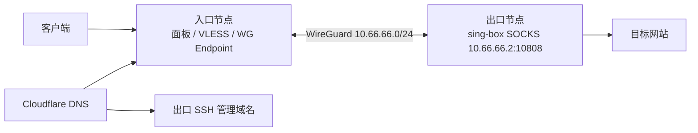

# wgstack

**中转落地链路自动化部署与运维工具。**

wgstack 用来搭建「入口节点 + 出口节点」的中转落地底层链路：客户端连接入口节点，入口节点通过 WireGuard 隧道把指定流量转发到出口节点，最终由出口节点出网。

它负责底层链路、DNS、自动修复和健康检查；3x-ui / x-panel 面板里的入站、出站、路由规则仍由你手动配置。

## 架构



典型用法：

- 入口节点：接收客户端连接、运行面板、作为 WireGuard 服务端
- 出口节点：主动连接入口 WireGuard，在本机提供 SOCKS 出口
- Cloudflare：维护入口业务域名、WireGuard Endpoint、出口 SSH 管理域名

## 功能概览

wgstack 会自动完成：

- 安装 WireGuard
- 在出口节点安装 sing-box
- 生成 WireGuard 密钥和配置
- 下发 `/etc/wireguard/wg0.conf`
- 下发出口节点 sing-box 配置
- 启动 / 重启相关 systemd 服务
- 创建 / 更新 Cloudflare DNS 记录
- 自动验证 Cloudflare 记录是否写入
- 健康检查 DNS、WireGuard、SOCKS、出口连通性
- 出口节点 DDNS：维护出口 SSH 管理域名
- 入口节点自动修复：入口 IP / DNS 漂移后自动修复
- Telegram 运维通知
- 自更新 `wgstack self-update`

wgstack 不会做：

- 不会自动配置 3x-ui / x-panel 数据库
- 不会自动创建 VLESS 入站
- 不会自动申请 TLS 证书
- 不会替你购买、续费或管理 VPS
- 不会自动修改云厂商安全组

## 准备清单

| 项目 | 要求 |
|---|---|
| 入口节点 | Linux VPS，root 权限，能开放 UDP 51820 和代理入口端口 |
| 出口节点 | Linux VPS，root 权限，能主动访问入口节点 UDP 51820 |
| Cloudflare | 域名托管在 Cloudflare，API Token 有 DNS 编辑权限 |
| 域名 | 一个入口业务域名即可，如 `entry.example.com` |
| SSH | 支持密码或私钥登录 |

### Cloudflare Token 权限

推荐创建 Account API Token，权限至少包含：

- `Zone - Zone - Read`
- `Zone - DNS - Read`
- `Zone - DNS - Edit`

Token 可以写入 `wgstack.json`，也可以通过环境变量注入。若同时存在：

```text
环境变量 > 配置文件
```

默认环境变量名：

```bash
export CLOUDFLARE_API_TOKEN="你的 token"
```

## 端口与安全组

到云厂商控制台的 **安全组 / 防火墙 / 入方向规则** 放行。

### 入口节点

| 用途 | 协议 | 端口 | 来源 |
|---|---:|---:|---|
| SSH 管理 | TCP | 22 | 你的管理机 IP，或临时 `0.0.0.0/0` |
| WireGuard Endpoint | UDP | 51820 | 出口节点公网 IP，出口 IP 会变可先放 `0.0.0.0/0` |
| 面板访问 | TCP | 面板端口 | 你的管理机 IP |
| 代理入口 | TCP | 你在面板中配置的入站端口，如 443 | `0.0.0.0/0` |

### 出口节点

| 用途 | 协议 | 端口 | 来源 |
|---|---:|---:|---|
| SSH 管理 | TCP | 22 | 管理机 IP + 入口节点公网 IP |

出口节点的 `10.66.66.2:10808` 是 WireGuard 内网 SOCKS，不应对公网开放。

### 出方向

若你收紧过出方向规则，至少允许：

| 用途 | 协议 | 端口 |
|---|---:|---:|
| HTTPS / Cloudflare / Telegram / ipify | TCP | 443 |
| HTTP 安装源 | TCP | 80 |
| DNS | UDP/TCP | 53 |
| 出口连接入口 WireGuard | UDP | 51820 |

## 安装

```bash
bash <(curl -Ls https://raw.githubusercontent.com/Heartbeatc/wg-ddns/main/scripts/install.sh)
```

安装脚本会优先下载当前平台的预编译二进制，不需要预装 Go。

## 更新

```bash
wgstack self-update
```

更新到 main/latest：

```bash
wgstack self-update --ref main
```

如果安装在 `/usr/local/bin` 等需要 root 权限的位置：

```bash
sudo wgstack self-update --ref main
```

## 首次部署

运行：

```bash
wgstack
```

没有 `wgstack.json` 时，会自动进入 6 步向导。

### 6 步向导

1. **运行位置**：选择当前是在本地管理机、入口节点本机，还是出口节点本机运行。

2. **入口节点**：填写首次可连接地址。若当前就在入口节点上运行，wgstack 会自动检测本机公网 IP。

3. **出口节点**：填写首次可连接地址和 SSH 信息。连上后自动检测出口公网 IP。

4. **Cloudflare**：填写 Zone 和 API Token。

5. **域名**：默认只填写一个入口业务域名。面板、VLESS、WireGuard Endpoint 默认共用它。

6. **自动化**：默认启用出口 DDNS 和入口自动修复。只需要填写出口 SSH 管理域名和检查间隔。

向导结束后会自动预检：

- 验证 Cloudflare Token 和 Zone
- 创建 / 更新入口业务域名 DNS
- 创建 / 更新出口 SSH 管理域名 DNS
- 用 Cloudflare API 反查确认记录已写入
- 检查入口 / 出口 SSH 或本机环境

本地或运营商 DNS 缓存没刷新时，只会提示，不会阻塞部署。

### 域名怎么填

通常只需要两个域名：

| 域名 | 作用 | 指向 |
|---|---|---|
| 入口业务域名，如 `h.example.com` | 面板、VLESS、WG Endpoint 默认共用 | 入口公网 IP |
| 出口 SSH 管理域名，如 `exit.example.com` | 管理端 SSH 到出口节点 | 出口公网 IP |

不需要提前去 Cloudflare 手动创建记录。wgstack 会在预检和部署时自动创建 / 更新。

### 运行位置会自动识别

CLI 命令会检测本机公网 IP：

- 如果等于入口节点 IP，自动等价于 `--local-entry`
- 如果等于出口节点 IP，自动等价于 `--local-exit`

你仍然可以显式指定：

```bash
wgstack health --live --local-entry
wgstack apply --local-exit
```

## 面板配置

底层部署成功后，进入 3x-ui / x-panel 手动配置。

### 1. 添加 SOCKS 出站

| 字段 | 值 |
|---|---|
| 标签 / tag | `exit-socks` |
| 协议 | SOCKS |
| 地址 | `10.66.66.2` |
| 端口 | `10808` |
| 用户名 / 密码 | 留空 |
| MUX | 关闭 |

### 2. 添加专用入站 / 节点

- 节点地址填写入口业务域名
- 不要填写出口节点 IP
- 面板和代理入口共用域名是正常的，端口和入站配置才区分用途
- 绑定专用用户标识：`exit-user@local`

### 3. 添加路由规则

| 字段 | 值 |
|---|---|
| 匹配用户 | `exit-user@local` |
| 出站标签 | `exit-socks` |

保存后重启 Xray。

### 4. 验证

客户端连接专用线路节点后访问：

```text
https://ifconfig.me
```

看到出口节点公网 IP 即成功。

## 日常命令

```bash
wgstack                  # 打开主菜单
wgstack apply            # 重新部署
wgstack health --live    # 实时健康检查
wgstack reconcile        # 手动同步 DNS / 修复入口 IP 漂移
wgstack guide            # 查看面板配置说明
wgstack self-update      # 更新 wgstack
```

指定配置文件：

```bash
wgstack health --live --config /path/to/wgstack.json
```

## 健康检查

```bash
wgstack health --live
```

典型通过结果：

```text
- [PASS] DNS: 所有域名均解析到 入口公网 IP
- [PASS] 入口 WireGuard: 最近握手 6s 前
- [PASS] 出口 WireGuard: 最近握手 6s 前
- [PASS] 出口 SOCKS: 10.66.66.2:10808 正在监听
- [PASS] 出口验证: 出口 IP: x.x.x.x
- [PASS] 出口管理 DDNS: timer 运行中
- [PASS] 入口自动修复: timer 运行中
```

如果 WireGuard 握手为 0，优先检查入口节点 UDP 51820 安全组。

## 自动化能力

### 入口自动修复

部署在入口节点上，默认启用。

它会定时检查：

- 当前入口公网 IP
- Cloudflare 中入口业务域名的 A 记录
- DNS content / TTL / proxied 是否偏离配置

触发条件：

- 入口 IP 变化
- DNS 记录漂移
- 记录被删除

触发动作：

- 更新 Cloudflare DNS
- 入口 IP 变化时，等待出口节点解析到新 WG Endpoint 后重启出口 WireGuard
- Telegram 通知
- 失败时不写入完成状态，下次 timer 自动重试

配置示例：

```json
"entry_autoreconcile": {
  "enabled": true,
  "interval_seconds": 60
}
```

查看日志：

```bash
journalctl -u wgstack-reconcile -n 100 --no-pager
```

### 出口管理 DDNS

部署在出口节点上，默认启用。

它维护出口 SSH 管理域名，保证出口 IP 变化后，管理端仍然可以通过域名连上出口节点。

配置示例：

```json
"exit_ddns": {
  "enabled": true,
  "domain": "exit.example.com",
  "interval_seconds": 60
}
```

同时必须保证：

```json
"nodes": {
  "hk": {
    "ssh_host": "exit.example.com"
  }
}
```

`nodes.hk.ssh_host` 必须和 `exit_ddns.domain` 一致。

查看日志：

```bash
journalctl -u wgstack-ddns -n 100 --no-pager
```

### 两者区别

| 能力 | 部署位置 | 维护对象 | 目的 |
|---|---|---|---|
| 入口自动修复 | 入口节点 | 入口业务域名 / WG Endpoint | 保持代理链路可用 |
| 出口管理 DDNS | 出口节点 | 出口 SSH 管理域名 | 保持管理端能连上出口 |

## Telegram 通知

支持事件：

- 部署成功 / 失败
- 入口 IP 变化
- DNS 修复
- reconcile 失败
- health 失败

配置：

```json
"notifications": {
  "enabled": true,
  "telegram": {
    "bot_token_env": "TELEGRAM_BOT_TOKEN",
    "chat_id": "-100123456789"
  }
}
```

环境变量：

```bash
export TELEGRAM_BOT_TOKEN="123456:ABC..."
```

IP 信息增强使用 ipinfo.io HTTPS API，并附带 `https://iplark.com/{ip}` 供人工查看 IP 质量。

通知失败不会中断部署、健康检查或自动修复。

## 配置文件安全

`wgstack.json` 可能包含：

- SSH 密码
- Cloudflare Token
- WireGuard 私钥
- Telegram Bot Token

程序会以 `0600` 权限保存配置文件。建议：

- 不要把 `wgstack.json` 提交到 Git
- SSH 密码优先用 `password_env`
- Cloudflare Token 优先用 `token_env`
- Telegram Bot Token 优先用 `bot_token_env`
- 能用私钥登录就不要用密码登录

## 配置片段

### Cloudflare

```json
"cloudflare": {
  "zone": "example.com",
  "token_env": "CLOUDFLARE_API_TOKEN",
  "record_type": "A",
  "ttl": 120,
  "proxied": false
}
```

### 节点

```json
"nodes": {
  "us": {
    "role": "entry",
    "host": "1.2.3.4",
    "ssh_host": "entry.example.com"
  },
  "hk": {
    "role": "exit",
    "host": "5.6.7.8",
    "ssh_host": "exit.example.com"
  }
}
```

`host` 是当前公网 IP，主要用于 DNS、健康检查和摘要。

`ssh_host` 是管理连接地址，必须 DNS only，不要开启 Cloudflare 代理。

## 常见问题

### Cloudflare 报 `Invalid access token`

检查：

- Token 是否有 Zone Read / DNS Read / DNS Edit 权限
- `cloudflare.zone` 是否写对
- 如果配置了 `token_env`，环境变量是否真的存在
- 环境变量会覆盖配置文件中的旧 token

验证：

```bash
curl -s "https://api.cloudflare.com/client/v4/zones?name=example.com" \
  -H "Authorization: Bearer $CLOUDFLARE_API_TOKEN" \
  -H "Content-Type: application/json"
```

### DNS 已创建，但本机 ping 不通

这通常是本地 DNS 缓存或运营商缓存。wgstack 以 Cloudflare API 反查为准，只要 Cloudflare 记录正确，就不会阻塞部署。

可检查：

```bash
dig entry.example.com
```

### WireGuard 握手为 0

优先检查：

- 入口节点安全组是否放行 UDP 51820
- 出口节点是否能出站访问入口 UDP 51820
- 入口节点 `wg-quick@wg0` 是否运行
- 出口节点 `wg-quick@wg0` 是否运行

命令：

```bash
systemctl status wg-quick@wg0 --no-pager
wg show
```

### 出口验证失败

如果 SOCKS 监听通过，但出口验证失败：

- 确认 WireGuard 有最近握手
- 确认入口能访问 `10.66.66.2:10808`
- 确认出口节点 sing-box 正常

```bash
systemctl status sing-box --no-pager
ss -lnt | grep 10808
```

### `exit_check_url` 返回错误

`healthcheck.exit_check_url` 必须返回纯文本公网 IPv4，例如：

```json
"exit_check_url": "https://api.ipify.org"
```

不要填返回 HTML、JSON 或国家代码的地址。

### 在目标节点本机运行报 SSH auth 错误

新版本会自动检测本机公网 IP 并使用本地模式。也可以显式指定：

```bash
wgstack health --live --local-entry
wgstack apply --local-exit
```

## 高级命令

```bash
wgstack init          # 生成配置模板
wgstack plan          # 查看部署计划
wgstack render        # 渲染本地配置文件
wgstack apply         # 部署
wgstack guide         # 查看面板操作说明
wgstack health        # 查看预期检查项
wgstack health --live # 实时检查
wgstack reconcile     # 手动 DNS 同步 / 修复入口 IP 漂移
wgstack self-update   # 自更新
```

## 项目边界

wgstack 是中转落地**底层链路**解决方案。它把入口节点、出口节点、WireGuard、出口 SOCKS、Cloudflare DNS 和自动修复串起来。

如果你希望完整的业务层自动化，后续可以继续扩展 3x-ui / x-panel API 集成；当前版本刻意不直接修改面板数据库。
